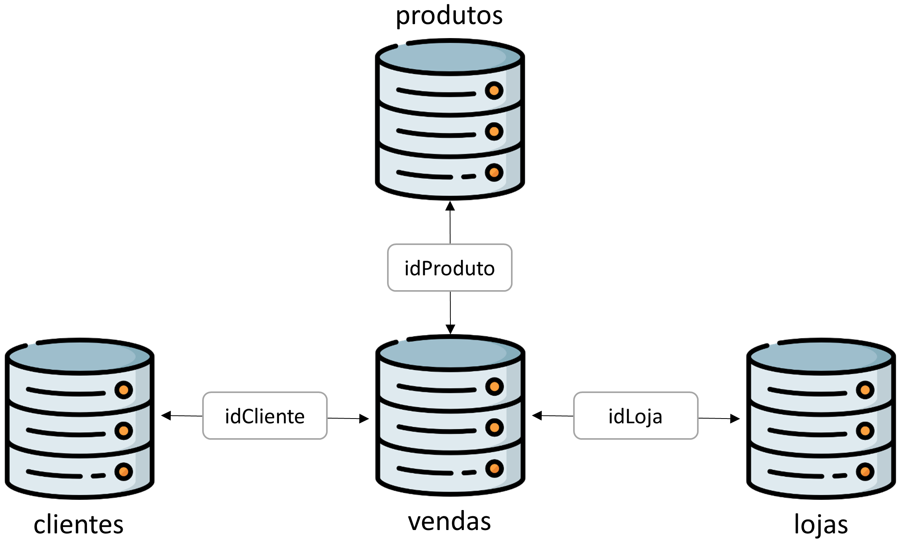

# SQL X Pandas: Duas abordagens para uma mesma consulta

Este repositório contém os notebooks e as consultas (queries) de uma análise de dados realizada sobre uma base de dados de venda de produtos. A base de dados é composta por quatro tabelas, a saber: vendas, clientes, produtos e lojas. A figura abaixo mostra as tabelas e os relacionamentos entre estas na base de dados:

<!--  -->

    

Através de consultas, que podem ser realizadas tanto por SQL (Structured Query Language) quanto pela biblioteca Pandas, do Python, são respondidas cinco perguntas sobre a base de dados, que são:

1. Qual a quantidade de produtos únicos que foram vendidos?
2. Quais os três produtos mais vendidos e as quantidades destes?
3. Quais as quantidades mensais vendidas do produto camisa de tamanho G no ano de 2019?
4. Qual a média da receita líquida mensal de vendas no ano de 2019?
5. Qual loja teve a maior receita líquida de vendas no ano de 2019?

As consultas que respondem as perguntas em SQL (SQLite, especificamente) se encontram no diretório [queries](src/queries/), já as consultas com o Pandas se encontram no notebook [queries-pandas](notebooks/queries-pandas.ipynb). Além destes, o notebook [queries-sqlite3](notebooks/queries-sqlite3.ipynb) apresenta as consultas executadas diretamente no Python, através da biblioteca SQLite3.

---
Links úteis:
- Blog post sobre SQL x Pandas: [Medium](https://rlrocha.medium.com/sql-x-pandas-4e33571498).
<!-- - Base de dados SQL - SQLite: [Link](https://www.sqlite.org/index.html).
- Biblioteca Python - Pandas: [Link](https://pandas.pydata.org/).
- Biblioteca Python - SQLite3: [Link](https://docs.python.org/3/library/sqlite3.html). -->